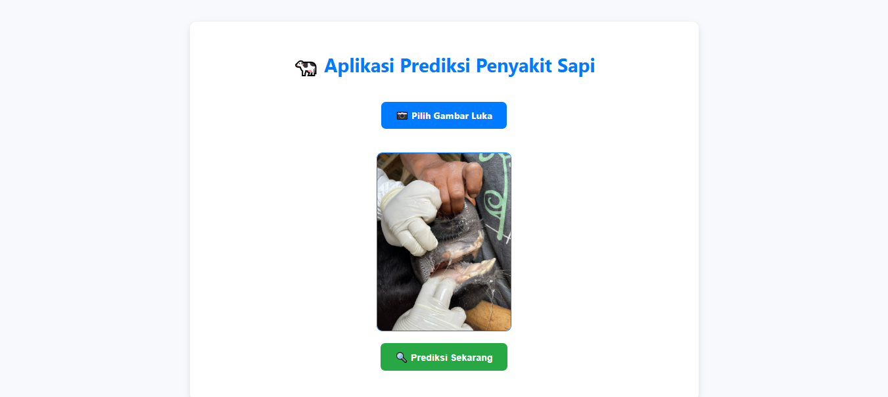
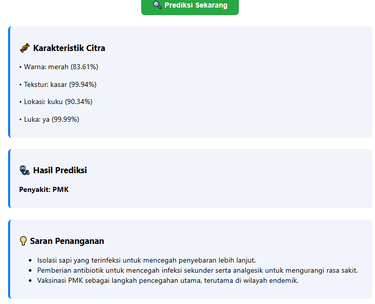

# 🐄 Cow Disease Detection & Prediction System

A web-based machine learning application for detecting and predicting cattle diseases from wound images.  
The system integrates **computer vision**, **machine learning**, and a **Flask web application** to assist early disease identification in cattle.

---

## 📌 Project Overview

This project aims to help identify cattle diseases by analyzing wound images and extracted visual features.  
The system works in two main stages:

1. **Feature Detection (Computer Vision)**  
   - Color  
   - Texture  
   - Wound location  
   - Presence of wound  

2. **Disease Classification (Machine Learning)**  
   - Support Vector Machine (SVM) classifier  
   - StandardScaler for feature normalization  
   - Rule-based post-processing for logical consistency  

---

## 🧠 Machine Learning Approach

- **Feature Extraction**:  
  Azure Custom Vision (image-based classification for visual features)

- **Classifier**:  
  Support Vector Machine (SVM)

- **Target Classes**:
  - PMK (Foot-and-Mouth Disease)
  - Foot Rot
  - Necrotic Stomatitis
  - Healthy

- **Post-processing Rules**:
  - Logical correction based on wound presence
  - Confidence-based label adjustment

---

## 🏗️ Project Structure

```text
.
├── app/
│   ├── __init__.py
│   ├── config.py          # Configuration & constants
│   ├── ml_service.py      # ML logic & prediction pipeline
│   └── routes.py          # Flask routes
│
├── models/
│   ├── SVM_linear.pkl
│   └── scaler.pkl
│
├── notebook/
│   └── Diagnosis_Penyakit_Sapi.ipynb
│
├── static/
│   ├── uploads/           # Runtime image uploads (ignored in git)
│   └── style.css
│
├── templates/
│   └── index.html
│
├── .gitignore
├── app.py                 # Flask entry point
└── README.md
```
---

## 🏗️ INTERFACE




